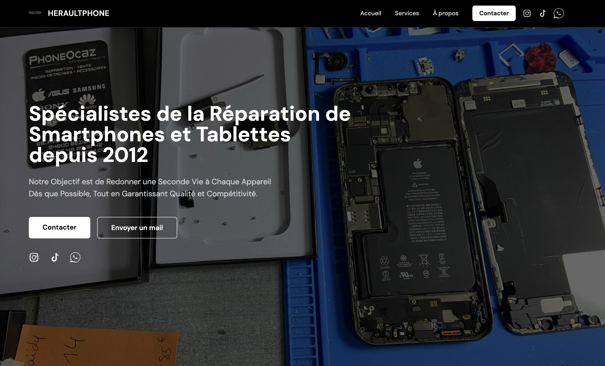
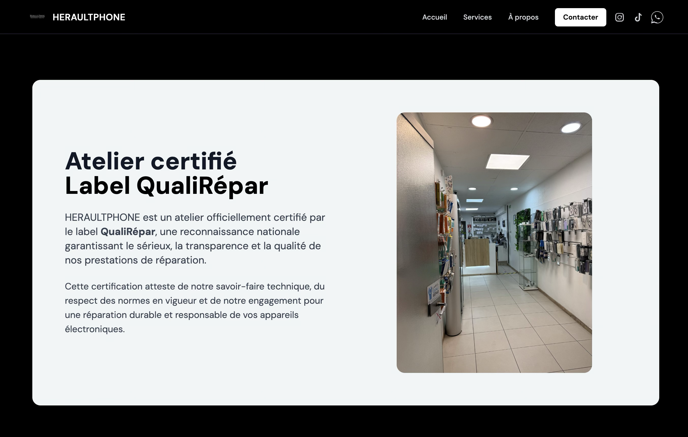
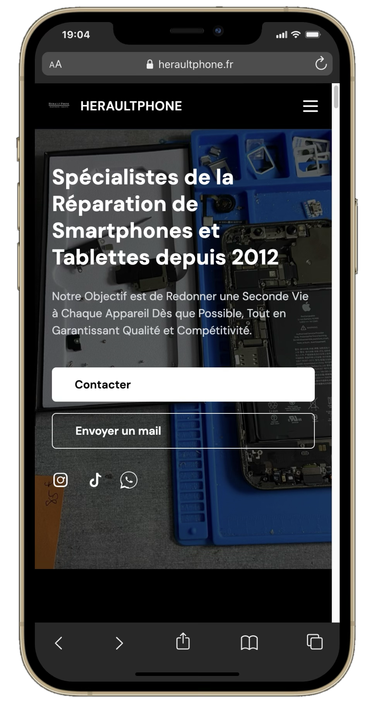
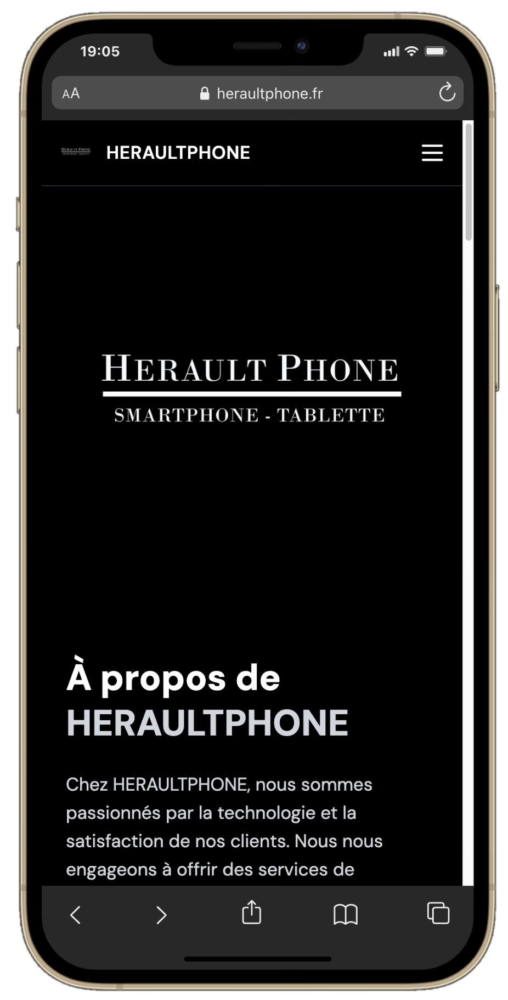

# HERAULTPHONE

### Description
Site vitrine développé pour HERAULTPHONE, spécialiste de la réparation de smartphones et tablettes à Béziers. Ce projet, réalisé pour mon premier client, présente les différents services de réparation, les réalisations avant/après, les marques prises en charge ainsi que les informations de la boutique.

**[Visiter le site](https://heraultphone.fr/)**

### Aperçu web

  
  

### Fonctionnalités

- Présentation des services de réparation
- Galerie avant / après
- Section avis clients
- FAQ interactive
- Présentation des marques prises en charge
- Informations boutique et horaires
- Carte interactive avec localisation de la boutique via Google Maps
- Design responsive

### Technologies

`HTML` · `Tailwind CSS` · `JavaScript`

### Aperçu mobile

  
  
  

